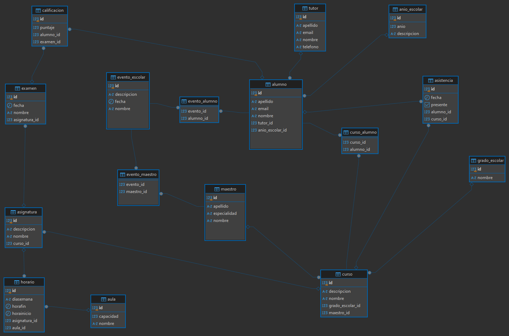
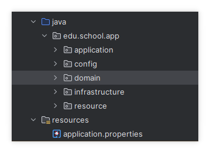
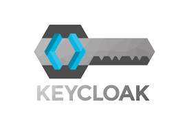

# curso-api A

El Sistema de Gestión Escolar es una plataforma integral diseñada para administrar todos los aspectos de una institución educativa. Proporciona herramientas para gestionar estudiantes, maestros, cursos, asignaturas, horarios, eventos, calificaciones, asistencias y tutores, garantizando una organización eficiente y centralizada. El sistema permite registrar, consultar, actualizar y organizar información académica y administrativa de manera estructurada, optimizando los procesos escolares.

#TABLA RELACIONADA
```sql script
1. TABLA ALUMNO
Propósito: Almacenar información personal y académica de los estudiantes.
Relaciones:
anio_escolar: Indica el año académico en el que está inscrito el alumno.
tutor: Asocia un tutor al estudiante.
curso_alumno: Relaciona al alumno con los cursos en los que está inscrito.
calificacion: Registra las calificaciones del alumno en exámenes.
asistencia: Administra el registro de asistencia del alumno.
evento_alumno: Relaciona al alumno con los eventos escolares en los que participa.

2. TABLA CURSO
Propósito: Definir los cursos ofrecidos por la institución.
Relaciones:
grado_escolar: Indica el nivel académico (grado) al que pertenece el curso.
maestro: Asocia un maestro responsable del curso.
curso_alumno: Relaciona alumnos inscritos en el curso.
asignatura: Define las asignaturas impartidas dentro del curso.
asistencia: Registra la asistencia de los estudiantes al curso.

3. TABLA ASIGNATURA
Propósito: Administrar las asignaturas ofrecidas en cada curso.
Relaciones:
curso: Asigna las materias a un curso específico.
examen: Vincula los exámenes realizados en esa asignatura.
horario: Establece los horarios de clases para cada asignatura.

4. TABLA EXAMEN
Propósito: Registrar los exámenes programados para cada asignatura.
Relaciones:
asignatura: Indica la asignatura a la que pertenece el examen.
calificacion: Registra los puntajes obtenidos por los alumnos en este examen.

5. TABLA CALIFICACION
Propósito: Almacenar las notas obtenidas por los estudiantes en los exámenes.
Relaciones:
examen: Identifica el examen asociado.
alumno: Registra el estudiante que obtuvo la calificación.

6. TABLA HORARIO
Propósito: Planificar los horarios de las clases impartidas.
Relaciones:
asignatura: Relaciona el horario con la asignatura impartida.
aula: Define el aula donde se imparte la clase.

7. TABLA AULA
Propósito: Administrar las aulas disponibles para las actividades académicas.
Relaciones:
horario: Asigna las aulas a los horarios de las clases.

8. TABLA MAESTRO
Propósito: Almacenar información de los maestros de la institución.
Relaciones:
curso: Asocia al maestro con los cursos que imparte.
evento_maestro: Relaciona al maestro con los eventos en los que participa.

9. TABLA TUTOR
Propósito: Representar a los tutores legales o responsables de los alumnos.
Relaciones:
alumno: Indica a los alumnos bajo la tutela del tutor.

10. TABLA ANIO_ESCOLAR
Propósito: Administrar los años académicos activos en la institución.
Relaciones:
alumno: Asocia a los alumnos con un año escolar específico.

11. TABLA GRADO_ESCOLAR
Propósito: Definir los niveles académicos (grados) de la institución.
Relaciones:
curso: Relaciona los grados escolares con los cursos ofrecidos.

12. TABLA ASISTENCIA
Propósito: Registrar la asistencia de los alumnos a los cursos.
Relaciones:
alumno: Indica el estudiante cuya asistencia se registra.
curso: Asocia la asistencia con un curso específico.

13. TABLA EVENTO_ESCOLAR
Propósito: Registrar eventos organizados por la institución educativa.
Relaciones:
evento_alumno: Relaciona alumnos participantes en el evento.
evento_maestro: Relaciona maestros participantes en el evento.

14. TABLA EVENTO_ALUMNO
Propósito: Relacionar alumnos con los eventos escolares.
Relaciones:
evento_escolar: Indica el evento al que pertenece.
alumno: Asocia al alumno participante.

15. TABLA EVENTO_MAESTRO
Propósito: Relacionar maestros con los eventos escolares.
Relaciones:
evento_escolar: Indica el evento al que pertenece.
maestro: Asocia al maestro participante.

16. TABLA CURSO_ALUMNO
Propósito: Relacionar alumnos con los cursos en los que están inscritos.
Relaciones:
alumno: Indica el estudiante inscrito.
curso: Relaciona el curso correspondiente.
```

## SCHEMA

## Running the application in dev mode

You can run your application in dev mode that enables live coding using:

```shell script
./mvnw compile quarkus:dev
```

## Resumen
Este sistema está diseñado para proporcionar una gestión completa de las operaciones escolares, facilitando la administración de datos relacionados con estudiantes, maestros, cursos, eventos y otras actividades académicas. Las relaciones entre las tablas aseguran la consistencia y la integración de la información en todas las áreas de la institución educativa.

- REST resources for Hibernate ORM with Panache ([guide](https://quarkus.io/guides/rest-data-panache)): Generate Jakarta
  REST resources for your Hibernate Panache entities and repositories

quarkus dev
./mvnw quarkus:dev


mvn -N wrapper:wrapper

## Dependencias del Proyecto
Descripción:
El proyecto utiliza Maven para la gestión de dependencias, y está basado en Quarkus, un framework diseñado para aplicaciones Java nativas en la nube y de alto rendimiento. A continuación, se documentan las dependencias incluidas en el archivo pom.xml, categorizadas por su propósito.
```sql script
1. Gestión de Dependencias (dependencyManagement)
   Esta sección centraliza la gestión de las versiones de dependencias relacionadas con Quarkus, garantizando consistencia en el proyecto.

Dependencia:
Group ID: ${quarkus.platform.group-id} (Definido como io.quarkus.platform).
Artifact ID: ${quarkus.platform.artifact-id} (Definido como quarkus-bom).
Version: ${quarkus.platform.version} (Definido como 3.16.2).
Tipo: pom (se utiliza como BOM - Bill of Materials).
Scope: import.
2. Dependencias del Proyecto
   2.1. Framework Core y Validaciones
   quarkus-hibernate-validator

Propósito: Proporciona validación de datos en el modelo usando Hibernate Validator (Bean Validation 2.0).
Uso: Validaciones como @NotNull, @Size, entre otras.
quarkus-arc

Propósito: Proporciona soporte para la inyección de dependencias (CDI - Context and Dependency Injection) en Quarkus.
Uso: Gestión de Beans e inyección de dependencias con @Inject.
2.2. Persistencia y Acceso a Datos
quarkus-hibernate-orm-panache

Propósito: Simplifica el uso de Hibernate ORM en Quarkus mediante el patrón Active Record y clases base de Panache.
Uso: Gestión de entidades JPA y queries.
quarkus-jdbc-postgresql

Propósito: Incluye el conector JDBC para PostgreSQL.
Uso: Permite la conexión a bases de datos PostgreSQL.
2.3. API REST y Serialización
quarkus-rest-jackson

Propósito: Serializa y deserializa objetos JSON en las APIs REST utilizando Jackson.
Uso: Comunicación de APIs REST con formato JSON.
quarkus-rest-client

Propósito: Implementa clientes REST para consumir servicios externos.
Uso: Crear clientes REST basados en interfaces para microservicios.
quarkus-rest-client-jackson

Propósito: Soporte de Jackson en clientes REST.
Uso: Serialización y deserialización automática en los clientes REST.
2.4. Seguridad
quarkus-oidc

Propósito: Proporciona autenticación basada en OpenID Connect (OIDC).
Uso: Implementación de seguridad en APIs con autenticación externa (OAuth2).
quarkus-smallrye-jwt

Propósito: Valida y procesa tokens JWT (JSON Web Token) en aplicaciones Quarkus.
Uso: Seguridad en endpoints protegidos por tokens.
2.5. Generación de Documentación
quarkus-smallrye-openapi
Propósito: Genera documentación de APIs REST en formato OpenAPI (Swagger).
Uso: Exposición de una interfaz web para consultar los endpoints y probar las APIs.
2.6. Soporte para Pruebas
quarkus-junit5

Propósito: Proporciona soporte para pruebas unitarias e integradas con JUnit 5.
Scope: test.
Uso: Escribir y ejecutar pruebas para el proyecto.
surefire-plugin (Definido en properties como versión 3.5.0).

Propósito: Gestiona la ejecución de pruebas unitarias durante la fase de test.
2.7. Mapas y Conversiones
mapstruct

Propósito: Framework para mapear objetos (DTOs y entidades) de manera automática mediante anotaciones.
Versión: 1.5.2.Final.
Uso: Facilita la conversión entre modelos y DTOs.
mapstruct-processor

Propósito: Complementa a mapstruct generando el código necesario para realizar el mapeo.
Scope: provided.
Uso: Incluido para la generación de código en tiempo de compilación.
2.8. Utilidades
lombok
Propósito: Simplifica el desarrollo al generar código repetitivo como getters, setters, toString, etc.
Versión: 1.18.24.
Scope: provided.
Uso: Reducir la escritura de código boilerplate en las clases.
Resumen
Este proyecto utiliza dependencias relacionadas con Quarkus para el desarrollo rápido de aplicaciones Java modernas, enfocándose en:

Persistencia: Hibernate ORM con Panache y PostgreSQL.
APIs REST: Jackson, clientes REST y OpenAPI.
Seguridad: OIDC y JWT.
Pruebas: JUnit 5.
Utilidades: Lombok y MapStruct para la simplificación del desarrollo.
```
## Arquitectura Hexagonal - Documentación de la Estructura del Proyecto
La arquitectura hexagonal, también conocida como "Arquitectura de Puertos y Adaptadores", organiza el proyecto en capas bien definidas. Cada capa tiene responsabilidades específicas, con el objetivo de mantener el núcleo del dominio desacoplado de la infraestructura y otros detalles técnicos. La estructura que se muestra refleja una implementación de esta arquitectura en el contexto de un sistema de gestión escolar.
```sql script
Estructura del Proyecto
La estructura de carpetas sigue un enfoque modular y limpio, alineado con los principios de la arquitectura hexagonal:

1. application
Propósito: Contiene los casos de uso y la lógica de aplicación. Esta capa interactúa con el dominio para ejecutar operaciones específicas.
Responsabilidades:
Implementar los casos de uso del sistema.
Gestionar la lógica relacionada con las operaciones de negocio a nivel de aplicación.
Actuar como intermediario entre la capa de dominio y las interfaces externas.
Ejemplo de Contenido:
Servicios de aplicación (e.g., StudentService, CourseService).
Implementaciones de interfaces de puertos definidos en el dominio.
2. config
Propósito: Gestiona la configuración del proyecto, como beans de Quarkus, configuración de seguridad, y otros aspectos técnicos.
Responsabilidades:
Configurar dependencias externas (e.g., bases de datos, seguridad, integración con APIs externas).
Gestionar configuraciones específicas del framework (Quarkus en este caso).
Ejemplo de Contenido:
Configuración de OIDC, JWT o propiedades del entorno.
Clases como DatabaseConfig o SecurityConfig.
3. domain
Propósito: Representa el núcleo del sistema. Contiene los modelos del dominio y las interfaces (puertos) que definen las reglas del negocio.
Responsabilidades:
Definir entidades de dominio (e.g., Student, Course, Teacher).
Incluir interfaces (puertos) que los adaptadores deben implementar.
Implementar la lógica de negocio pura, sin dependencias externas.
Ejemplo de Contenido:
Entidades JPA o Panache (e.g., StudentEntity, CourseEntity).
Interfaces de puertos (e.g., StudentRepository, CourseRepository).
Servicios de dominio con lógica independiente de la infraestructura.
4. infrastructure
Propósito: Proporciona implementaciones de los adaptadores necesarios para interactuar con sistemas externos, como bases de datos o servicios REST.
Responsabilidades:
Implementar los adaptadores secundarios (e.g., repositorios de datos, clientes REST).
Gestionar la interacción con detalles técnicos (e.g., acceso a la base de datos o integración con APIs externas).
Ejemplo de Contenido:
Implementaciones de repositorios (e.g., StudentRepositoryImpl).
Clientes REST o conectores externos (e.g., ExternalApiClient).
Configuración de conectores de base de datos o mensajería.
5. resource
Propósito: Contiene los controladores o endpoints expuestos para interactuar con el sistema.
Responsabilidades:
Implementar los adaptadores primarios, es decir, interfaces de entrada al sistema (como APIs REST).
Recibir solicitudes de usuarios o sistemas externos y delegarlas a los casos de uso de la capa application.
Ejemplo de Contenido:
Controladores REST (e.g., StudentController, CourseController).
Endpoints que exponen funcionalidades a través de HTTP.
6. resources
Propósito: Almacena los archivos de configuración y recursos estáticos del proyecto.
Responsabilidades:
Gestionar configuraciones específicas del entorno o del framework.
Incluir configuraciones de propiedades, scripts SQL o plantillas estáticas.
Ejemplo de Contenido:
Archivo application.properties: Contiene las configuraciones principales (base de datos, Quarkus, JWT, etc.).
Relación entre las Capas
Core del Sistema (domain):

Define las reglas de negocio y las interfaces (puertos).
Totalmente independiente de las demás capas.
Capa de Aplicación (application):

Interactúa directamente con el dominio.
Implementa la lógica para casos de uso específicos.
Adaptadores:

Primarios (resource): Manejan la interacción con el usuario o sistemas externos (por ejemplo, APIs REST).
Secundarios (infrastructure): Proveen implementaciones concretas para los puertos definidos en el dominio (repositorios, clientes REST, etc.).
Configuración (config):

Gestiona dependencias y configuraciones externas necesarias para el funcionamiento del sistema.
Beneficios de Esta Estructura
Desacoplamiento:
La lógica del negocio está aislada en el dominio, independiente de los detalles de la infraestructura.
Flexibilidad:
Cambiar un adaptador (e.g., de PostgreSQL a MongoDB) no afecta al núcleo del dominio.
Testabilidad:
Las reglas de negocio pueden ser probadas sin depender de las implementaciones de infraestructura.
Escalabilidad:
La modularidad permite añadir o modificar funcionalidades sin afectar otras partes del sistema.
```


## Integración de Keycloak para la Autenticación
Keycloak es un sistema de gestión de identidad y acceso (IAM) de código abierto. Proporciona autenticación y autorización listas para usar, soportando estándares como OpenID Connect (OIDC), OAuth2 y SAML. En este sistema, Keycloak se utiliza para manejar la autenticación de usuarios y proteger los recursos expuestos por las APIs REST.
## Objetivo
Proporcionar autenticación segura a través de OpenID Connect (OIDC).
Proteger los endpoints de la API REST utilizando JSON Web Tokens (JWT) generados por Keycloak.
Facilitar la gestión centralizada de usuarios, roles y permisos.
